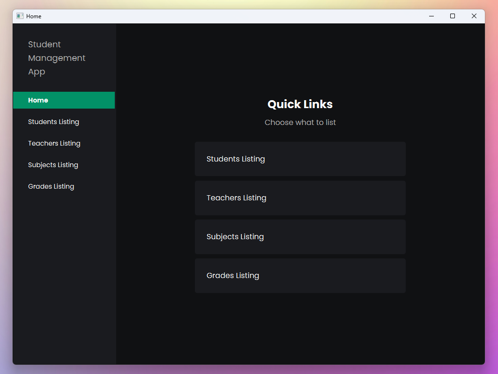
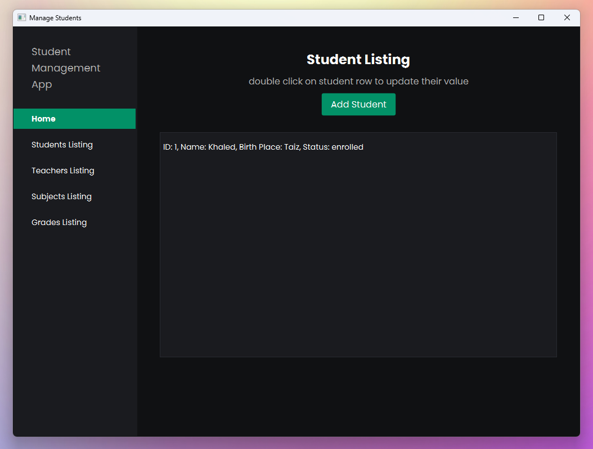
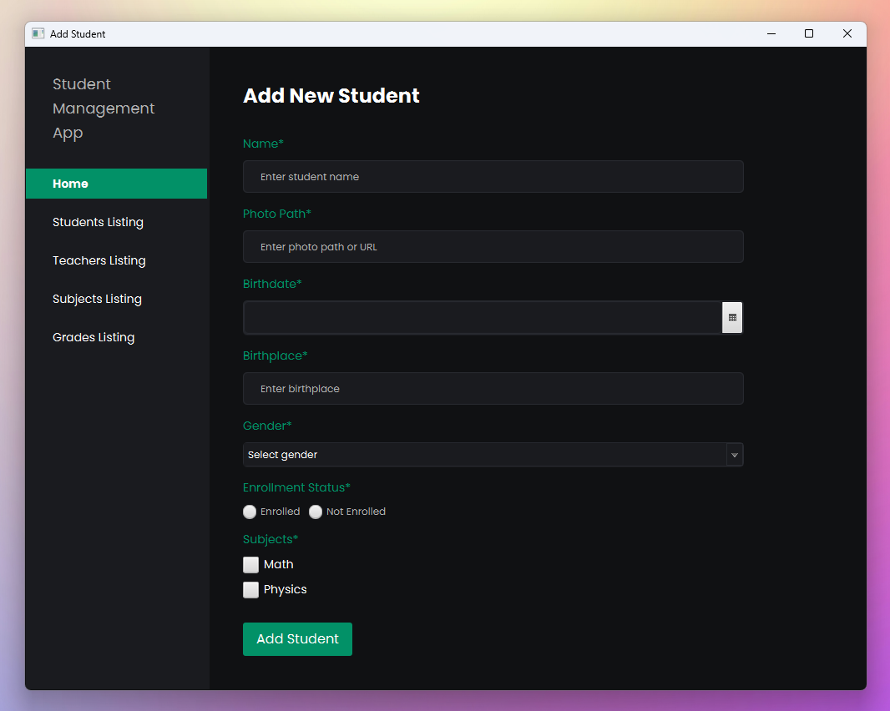

# Student Management Desktop Client

This is a simple JavaFX-based desktop application developed as a college assignment. The application serves as a client for managing students, teachers, subjects, and grades within a student management system. It interacts with an independent REST API for CRUD operations, which is hosted [here](https://github.com/khaledsAlshibani/student-management-api). Note that this project is designed for learning purposes, and as such, it has minimal security.

## Overview

The **Student Management Desktop Client** allows users to perform the following operations:

- **Student Management**: Add, view, update, and delete students, along with information like enrollment status, subjects, and other relevant details.
- **Teacher Management**: Add, view, update, and delete teachers.
- **Subject Management**: Add, view, update, and delete subjects with the option to associate subjects with students.
- **Grade Management**: Add, view, and delete grades associated with selected subjects.

The project aims to provide a basic understanding of client-server communication through REST APIs, as well as practical experience in building desktop applications with JavaFX.

### Screenshots

*Home screen showing quick links to different management sections.*

*Student listing screen, where users can view and manage student details.*

*Form for adding a new student with fields for name, photo, birthdate, gender, etc.*

---

## Technologies Used

- **Java**: Main programming language.
- **JavaFX**: For building the graphical user interface.
- **JSON**: For data interchange between the client and the server.
- **HTTP**: Used for communication with the REST API.
- **Maven**: Dependency management.

## Security Considerations

This project is intended for educational purposes, and **security has not been prioritized**. Authentication and authorization are not implemented, meaning any user can perform CRUD operations without any verification. This would make the application insecure in a real-world context, especially if sensitive data were involved.

For this reason, it is strongly recommended to avoid using the application for real usage cases.

## Project Structure

The project consists of a **JavaFX client** and an independent **API backend**. The API is not included in this project’s directory; it is hosted separately and can be found here: [student-management-api](https://github.com/khaledsAlshibani/student-management-api). This separation allows for potential future enhancements to the API, which could be extended for use in a web application as well.

### Key Directories and Files

- `src/main/java/com/kss/studentmanagementdesktopclient/`: Contains all Java code for the client.
    - `app/`: Holds utility classes and the `ViewManager` for handling scene transitions.
    - `controller/`: Controllers for each feature, including students, teachers, subjects, and grades.
    - `api/`: API service classes responsible for HTTP requests to the backend API.
- `src/main/resources/`: Contains FXML files for UI layouts and CSS files for styling.
    - `component/`: FXML reusable standalone components used in the views.
    - `view/`: FXML layouts for each view.
    - `style/`: Stylesheets for UI customization.

## How to Use

1. **Set Up the API**: Ensure that the REST API is running. Follow the setup instructions in the [student-management-api](https://github.com/khaledsAlshibani/student-management-api) repository to deploy the API locally or use the provided online URL.
2. **Build & Run**

## Features

### Student Management

- **View All Students**: Displays a list of all students, including details such as ID, name, birthplace, and enrollment status.
- **Add Student**: Allows adding a new student with fields like name, photo, birthdate, gender, enrollment status, and associated subjects.
- **Update Student**: Edit details for an existing student.
- **Delete Student**: Remove a student from the system.

### Teacher Management

- **View All Teachers**: Displays all teachers.
- **Add Teacher**: Adds a new teacher with a specified name.
- **Update Teacher**: Edits an existing teacher's information.
- **Delete Teacher**: Removes a teacher from the system.

### Subject Management

- **View All Subjects**: Lists all available subjects.
- **Add Subject**: Adds a new subject and optionally associates it with students.
- **Update Subject**: Updates details of a specific subject.
- **Delete Subject**: Deletes a subject.

### Grade Management

- **View All Grades**: Displays all grade records.
- **Add Grade**: Allows the user to assign a grade to selected subjects.
- **Delete Grade**: Removes a grade record.

## Notes

- **Data Synchronization**: As the API and the client are separate, there is no live data synchronization. You will need to refresh views manually to see any updates made through the API.
- **Weak Error Handling**: While basic error handling is in place, errors are often logged to the console. Future improvements could include more user-friendly error messages and detailed handling for specific issues.

## Future Enhancements

There are no plans to enhance the application further, as it was created primarily as a college assignment. However, since the project is open-source and the API is maintained separately, future enhancements remain possible.